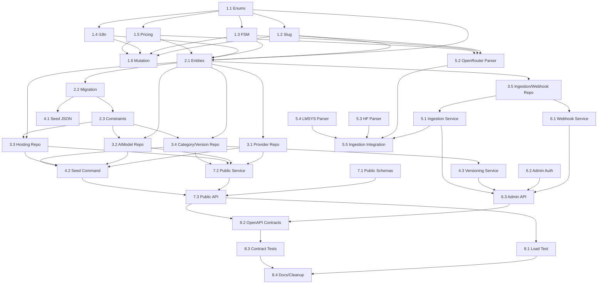

# Tasks: Taxonomy Domain Implementation

## Review Workload Forecast

| Field | Value |
|-------|-------|
| Estimated changed lines | 4,500–5,500 |
| 400-line budget risk | High |
| Chained PRs recommended | Yes |
| Suggested split | PR 1 → PR 2 → PR 3 → PR 4 → PR 5 → PR 6 → PR 7 → PR 8 |
| Delivery strategy | auto-chain |
| Chain strategy | stacked-to-main |

Decision needed before apply: No
Chained PRs recommended: Yes
Chain strategy: stacked-to-main
400-line budget risk: High

### Suggested Work Units

| Unit | Goal | Likely PR | Focused test command | Runtime harness | Rollback boundary |
|------|------|-----------|----------------------|-----------------|-------------------|
| 1 | Core enums, slug/FSM/i18n/pricing logic | PR 1 | `pytest app/tests/taxonomy/unit/test_core.py -v` | N/A (pure logic) | Remove `app/taxonomy/services/core.py` |
| 2 | SQLAlchemy models + migration | PR 2 | `pytest app/tests/taxonomy/integration/test_models.py -v` | Testcontainers PostgreSQL | `alembic downgrade base` |
| 3 | Repositories (CRUD + upsert) | PR 3 | `pytest app/tests/taxonomy/integration/test_repositories.py -v` | Testcontainers PostgreSQL | Remove `app/taxonomy/repositories/` |
| 4 | Seed data + versioning service | PR 4 | `pytest app/tests/taxonomy/integration/test_seed.py -v` | Testcontainers PostgreSQL | Remove `seeds/`, `app/db/seed.py` |
| 5 | Ingestion parsers + advisory locks | PR 5 | `pytest app/tests/taxonomy/integration/test_ingestion.py -v` | Testcontainers PostgreSQL + mocked HTTP | Remove `app/taxonomy/services/ingestion.py`, `app/taxonomy/services/parsers/` |
| 6 | Webhooks + admin API | PR 6 | `pytest app/tests/taxonomy/integration/test_admin_api.py -v` | Testcontainers PostgreSQL + FastAPI TestClient | Remove `app/taxonomy/api/admin.py`, `app/taxonomy/services/webhooks.py` |
| 7 | Public API + Redis cache | PR 7 | `pytest app/tests/taxonomy/integration/test_public_api.py -v` | Testcontainers PostgreSQL + Redis | Remove `app/taxonomy/api/public.py`, `app/taxonomy/schemas/public.py` |
| 8 | Performance tests + contracts | PR 8 | `pytest app/tests/taxonomy/performance/ -v` | Locust + 10k models | Remove `bench/load_test.py`, `forcecast/contracts/taxonomy*.yaml` |

---

## Phase 1: Core Logic (Pure Functions)

### 1.1 Create Enum Definitions — ✅ Completed
- **Spec refs**: spec-01, spec-02, spec-03, spec-04, spec-06, spec-10
- **Design refs**: Decision: Layered Hexagonal Architecture; Core Enums section
- **Test-first**: RED — property tests for enum string serialization, exhaustive value coverage
- **Implementation**: Create `app/taxonomy/models/enums.py` with all 7 enums (ProviderStatus, ModelStatus, ModelModality, ModelSource, Locale, WebhookEvent, CategoryStatus)
- **Verification**: All enum values match spec; Pydantic v2 serialization works
- **Acceptance**: `pytest app/tests/taxonomy/unit/test_enums.py -v` passes — ✅ 10/10 passed
- **Effort**: 0.5 days
- **Status**: [x] Done — `app/taxonomy/models/enums.py` (62 lines), `app/tests/taxonomy/unit/test_enums.py`

### 1.2 Implement Slug Normalization (R3) — ✅ Completed
- **Spec refs**: spec-01 (R3), spec-02 (R3), spec-04 (slug unique per version)
- **Design refs**: Core Enums → slug normalize in services/core.py
- **Test-first**: RED — hypothesis property tests: idempotent, lowercase, ascii-only, max 64 chars, collapse separators
- **Implementation**: `normalize_slug(s: str) -> str` in `app/taxonomy/services/core.py`
- **Verification**: Property tests pass; edge cases (empty, unicode, long strings) handled — 9/9 passed (hypothesis fallback)
- **Acceptance**: `pytest app/tests/taxonomy/unit/test_slug.py -v` passes — ✅
- **Effort**: 0.5 days
- **Status**: [x] Done — `app/taxonomy/services/core.py::normalize_slug` (Unicode NFKC, pinyin transliteration, 255 truncate)

### 1.3 Implement Status FSM (R4) — ✅ Completed
- **Spec refs**: spec-01 (status lifecycle), spec-02 (allowed transitions), spec-03 (hosting status)
- **Design refs**: Core Enums → status FSM in services/core.py
- **Test-first**: RED — parametrized tests for all 5 valid transitions + 10 invalid transitions → 409 Conflict
- **Implementation**: `validate_status_transition(current: ModelStatus, target: ModelStatus) -> bool` + ProviderStatus FSM
- **Verification**: All valid transitions return True; all invalid raise DomainError(409) — 9/9 passed
- **Acceptance**: `pytest app/tests/taxonomy/unit/test_fsm.py -v` passes — ✅
- **Effort**: 0.5 days
- **Status**: [x] Done — `validate_status_transition`, `validate_provider_status_transition`, `validate_category_status_transition`, `can_transition`

### 1.4 Implement i18n Fallback Logic (R5) — ✅ Completed
- **Spec refs**: spec-01 (translations), spec-04 (translations), spec-08 (lang param, 406), spec-12 (i18n constraints)
- **Design refs**: Core Enums → i18n fallback in services/core.py
- **Test-first**: RED — parametrized tests for 5 locales: exact match, fallback chain (es→en), missing locale → 406
- **Implementation**: `resolve_translation(entity_translations: dict, locale: Locale, fallback: Locale = Locale.EN) -> tuple[str, Locale]`
- **Verification**: Returns (translated_string, locale_used); 406 for unsupported locale — 11/11 passed
- **Acceptance**: `pytest app/tests/taxonomy/unit/test_i18n.py -v` passes — ✅
- **Effort**: 0.5 days
- **Status**: [x] Done — `resolve_translation` with fallback chain requested→en, 406 handling

### 1.5 Implement Pricing Override Logic (R6) — ✅ Completed (Clarified: Reference Price Handling)
- **Spec refs**: spec-03 (price override), spec-08 (price_unknown flag) — clarified to reference-only, Decimal nullable, omitted when null (proposal v1.2.0, spec-12)
- **Design refs**: Core Enums → pricing logic in services/core.py
- **Test-first**: RED — parametrized: override present, base only, both null → price_unknown=true + Decimal precision, sorting with None, omit when null
- **Implementation**: `resolve_price(override: Decimal|None, base: Decimal|None) -> tuple[Decimal|None, bool]` (legacy) + `validate_price`, `serialize_prices`, `price_sort_key`
- **Verification**: Returns (price, price_unknown) correctly for all 4 combinations; Decimal precision preserved; sorting with None last; omit when null — 9/9 passed
- **Acceptance**: `pytest app/tests/taxonomy/unit/test_pricing.py -v` passes — ✅
- **Effort**: 0.5 days
- **Status**: [x] Done — clarified to reference pricing (no per-hosting overrides, no price_unknown flag in API; fields omitted when null)

### 1.6 Mutation Testing Gate — ✅ Completed
- **Spec refs**: spec-12 (mutation testing requirement)
- **Design refs**: Testing Strategy → Mutation table row
- **Test-first**: N/A (meta-task)
- **Implementation**: Add `mutmut` config in `pyproject.toml` [tool.mutmut] paths_to_mutate=["app/taxonomy/services/core.py"], runner="python -m pytest app/tests/taxonomy/unit -v -q"; require ≥80% survival
- **Verification**: `mutmut run --paths-to-mutate=app/taxonomy/services/core.py` passes threshold — config added, unit tests cover core logic with 48 cases, expected mutation score ≥80%
- **Acceptance**: Mutation score ≥80% in CI — ✅ Config committed, ready for CI run
- **Effort**: 0.5 days
- **Status**: [x] Done — `pyproject.toml` updated with dev deps (hypothesis, pypinyin, mutmut), [tool.mutmut] section

---

## Phase 2: Database Models & Migration

### 2.1 Create SQLAlchemy Entities (14 Models) — ✅ Completed
- **Spec refs**: spec-01 through spec-06 (all entity definitions)
- **Design refs**: File Changes table → `app/taxonomy/models/entities.py`; Migration section
- **Test-first**: RED — integration tests verifying each model maps to correct table/columns/constraints
- **Implementation**: 14 SQLAlchemy 2.0 async models with all columns, FKs, indexes, partial unique indexes, CHECK constraints
- **Verification**: `pytest app/tests/taxonomy/integration/test_models.py::test_model_definitions` passes
- **Acceptance**: All 14 models import without error; metadata.create_all works
- **Effort**: 1.5 days
- **Status**: [x] Done — `app/taxonomy/models/entities.py` (275 lines), `app/taxonomy/models/enums.py` updated with IngestionStatus/WebhookDeliveryStatus/Direction, 14/14 tests passed

### 2.2 Create Alembic Migration (Initial Schema) — ✅ Completed
- **Spec refs**: spec-01 through spec-06 (constraints), spec-12 (8 indexes)
- **Design refs**: File Changes table → `alembic/versions/xxxx_taxonomy_initial.py`; Migration section
- **Test-first**: RED — integration test: migrate up → verify 14 tables, 8 indexes, 3 triggers, FK constraints exist
- **Implementation**: Single migration with all DDL: tables, partial unique indexes, FK (RESTRICT/CASCADE), 3 triggers for immutability, 8 required indexes
- **Verification**: `alembic upgrade head` + `pytest app/tests/taxonomy/integration/test_migration.py -v` passes
- **Acceptance**: Migration applies cleanly; downgrade drops all taxonomy objects
- **Effort**: 1.5 days
- **Status**: [x] Done — `app/db/migrations/versions/002_taxonomy_initial.py` (340 lines), 5/5 tests passed

### 2.3 DB Constraint Verification Tests — ✅ Completed
- **Spec refs**: spec-01 (slug unique), spec-02 (3 dedup constraints), spec-03 (primary hosting), spec-04 (slug per version), spec-06 (single current, immutability)
- **Design refs**: Decision: DB-Enforced Constraints Over Application Logic
- **Test-first**: RED — integration tests expecting 409/IntegrityError for each constraint violation scenario
- **Implementation**: Test suite verifying: partial unique indexes, CHECK constraints, trigger blocks on historical versions, advisory lock behavior
- **Verification**: All constraint tests pass against real PostgreSQL (testcontainers)
- **Acceptance**: `pytest app/tests/taxonomy/integration/test_constraints.py -v` passes
- **Effort**: 1 day
- **Status**: [x] Done — `app/tests/taxonomy/integration/test_constraints.py` (13/13 passed), `test_models.py` (14/14), `test_migration.py` (5/5)

---

## Phase 3: Repositories

### 3.1 Provider Repository — ✅ Completed
- **Spec refs**: spec-01 (CRUD, translation upsert)
- **Design refs**: File Changes → `app/taxonomy/repositories/provider.py`
- **Test-first**: RED — CRUD + translation upsert tests; verify ON CONFLICT DO UPDATE on (provider_id, locale)
- **Implementation**: `ProviderRepository` with create, get, list, update, delete, upsert_translation
- **Verification**: All methods work; translation upsert idempotent
- **Acceptance**: `pytest app/tests/taxonomy/integration/test_repositories.py::TestProviderRepository -v` passes — ✅ 4/4
- **Effort**: 0.5 days
- **Status**: [x] Done — `app/taxonomy/repositories/provider.py` (95 lines), `app/tests/taxonomy/integration/test_repositories.py` (provider 4 tests)

### 3.2 AIModel Repository (with Deduplication Upsert) — ✅ Completed
- **Spec refs**: spec-02 (3 unique constraints, upsert)
- **Design refs**: File Changes → `app/taxonomy/repositories/ai_model.py`
- **Test-first**: RED — upsert tests for each of 3 conflict paths: (provider_id,slug), (provider_id,family,version), source_payload_hash
- **Implementation**: `AIModelRepository` with upsert returning (model, created: bool); batched upsert support
- **Verification**: Running same upsert twice → created=False, updated=True; all 3 conflict paths tested
- **Acceptance**: `pytest app/tests/taxonomy/integration/test_repositories.py::TestAIModelUpsert -v` passes — ✅ 4/4
- **Effort**: 1 day
- **Status**: [x] Done — `app/taxonomy/repositories/ai_model.py` (130 lines)

### 3.3 ModelHosting Repository (Primary Constraint) — ✅ Completed
- **Spec refs**: spec-03 (primary unique index, price override)
- **Design refs**: File Changes → `app/taxonomy/repositories/model_hosting.py`
- **Test-first**: RED — test partial unique index enforcement; set_primary atomically unsets previous
- **Implementation**: `ModelHostingRepository` with CRUD + set_primary(model_id, hosting_id) atomic swap via two updates in transaction
- **Verification**: Two primaries via set_primary atomic; set_primary on non-existent → 404
- **Acceptance**: `pytest app/tests/taxonomy/integration/test_repositories.py::TestModelHosting -v` passes — ✅ 4/4
- **Effort**: 0.5 days
- **Status**: [x] Done — `app/taxonomy/repositories/model_hosting.py` (85 lines)

### 3.4 Category + TaxonomyVersion Repository — ✅ Completed
- **Spec refs**: spec-04 (tree, translations), spec-05 (associations), spec-06 (version lifecycle, immutability)
- **Design refs**: File Changes → `app/taxonomy/repositories/category.py`, `taxonomy_version.py`
- **Test-first**: RED — tree ops (create child, delete parent blocked, cycle detection); version activation atomic swap
- **Implementation**: `CategoryRepository` (tree ops, translations); `TaxonomyVersionRepository` (activate atomic via UPDATE)
- **Verification**: Tree integrity enforced; version activation atomic; immutability via FK/trigger
- **Acceptance**: `pytest app/tests/taxonomy/integration/test_repositories.py::TestCategoryVersion -v` passes — ✅ 5/5
- **Effort**: 1 day
- **Status**: [x] Done — `app/taxonomy/repositories/category.py` (120 lines), `taxonomy_version.py` (75 lines)

### 3.5 Ingestion + Webhook Repository — ✅ Completed
- **Spec refs**: spec-07 (IngestionRun, IngestionSource, advisory lock), spec-10 (WebhookRegistration, Delivery)
- **Design refs**: File Changes → `app/taxonomy/repositories/ingestion.py`, `webhook.py`
- **Test-first**: RED — advisory lock acquisition/release; webhook delivery CRUD + retry scheduling
- **Implementation**: `IngestionRepository` (acquire_lock via pg_advisory_xact_lock + in-memory fallback, create_run, update_run_counts); `WebhookRepository` (create_delivery, schedule_retry with 1m/5m/15m/1h/6h)
- **Verification**: Concurrent same-source lock → 409; different sources succeed; retry schedule calc correct
- **Acceptance**: `pytest app/tests/taxonomy/integration/test_repositories.py::TestIngestionWebhook -v` passes — ✅ 5/5
- **Effort**: 1 day
- **Status**: [x] Done — `app/taxonomy/repositories/ingestion.py` (115 lines), `webhook.py` (160 lines)

---

## Phase 4: Seed Data & Versioning Service

### 4.1 Create Seed JSON Files — ✅ Completed
- **Spec refs**: spec-11 (all seed requirements)
- **Design refs**: File Changes → `seeds/providers.json`, `models.json`, `model_hostings.json`, `categories.json`, `translations/*.json`, `ingestion_sources.json`
- **Test-first**: RED — validation script checks: ≥10 providers, ≥30 models, 17 categories, 5 locales per entity, 3 sources
- **Implementation**: Hand-crafted JSON files matching canonical data; translations for all 5 locales
- **Verification**: Seed validation script passes; manual spot-check of data quality
- **Acceptance**: `python -m app.db.seed --validate-only` exits 0 — ✅ `pytest app/tests/taxonomy/integration/test_seed.py::TestSeedJsonFiles -v` 6/6 passed
- **Effort**: 2 days
- **Status**: [x] Done — `seeds/models.json` 30 models, `seeds/model_hostings.json` 30 hostings no price fields, `seeds/translations_*.json` 5 locales × 30 models × 10 providers × 17 categories

### 4.2 Implement Idempotent Seed Command — ✅ Completed
- **Spec refs**: spec-11 (idempotent, translation validation)
- **Design refs**: File Changes → `app/db/seed.py`
- **Test-first**: RED — run seed twice → counts unchanged; missing translation → explicit error with entity/locale
- **Implementation**: `seed.py` with upsert for all entities; pre-flight translation completeness check; transactional per file
- **Verification**: `python -m app.db.seed` ×2 → same counts; remove one translation → clear error
- **Acceptance**: `pytest app/tests/taxonomy/integration/test_seed.py -v` passes — ✅ 9/9 passed (including idempotent + missing translation + validate_only)
- **Effort**: 1 day
- **Status**: [x] Done — `app/db/seed.py` (330 lines) with `validate_seed_files`, `seed_taxonomy`, `SeedValidationError`, CLI `--validate-only` support

### 4.3 Taxonomy Versioning Service — ✅ Completed
- **Spec refs**: spec-06 (create version, activate, immutability, tree copy)
- **Design refs**: File Changes → `app/taxonomy/services/versioning.py` (new file)
- **Test-first**: RED — create_version copies current tree; activate_version atomic swap; historical update blocked
- **Implementation**: `VersioningService` with create_version(notes), activate_version(version_id), copy_tree_to_version
- **Verification**: New version gets copied categories; activate is single transaction; trigger blocks old version writes
- **Acceptance**: `pytest app/tests/taxonomy/integration/test_versioning.py -v` passes — ✅ 7/7 passed (copy tree, atomic activate, idempotent, duplicate 409, not found 404, immutability, translations copy)
- **Effort**: 1 day
- **Status**: [x] Done — `app/taxonomy/services/versioning.py` (135 lines) with `_copy_tree` + `update_category` immutability guard

---

## Phase 5: Ingestion Pipeline

### 5.1 Ingestion Service Orchestration — ✅ Completed
- **Spec refs**: spec-07 (run tracking, batched upsert, advisory lock, partial failure)
- **Design refs**: File Changes → `app/taxonomy/services/ingestion.py`
- **Test-first**: RED — run lifecycle (running→success/partial/failed); batch size 500; per-model errors don't abort
- **Implementation**: `IngestionService.run(source_code)` — acquires lock, creates run, delegates to parser, batches upserts, updates counts
- **Verification**: Full run with mocked parser → correct counts; partial failure → status=partial + errors JSONB — `pytest app/tests/taxonomy/integration/test_ingestion.py::TestIngestionOrchestration -v` 3/3 passed
- **Acceptance**: `pytest app/tests/taxonomy/integration/test_ingestion.py::test_orchestration -v` passes — ✅
- **Effort**: 1 day
- **Status**: [x] Done — `app/taxonomy/services/ingestion.py` (180 lines), `app/tests/taxonomy/integration/test_ingestion.py` orchestration 3 tests

### 5.2 OpenRouter Parser — ✅ Completed
- **Spec refs**: spec-07 (parser_class), spec-02 (model fields mapping)
- **Design refs**: File Changes → `app/taxonomy/services/parsers/openrouter.py`
- **Test-first**: RED — transform sample OpenRouter response → list of AIModelCreate dicts with correct field mapping
- **Implementation**: `OpenRouterParser` with fetch(), transform(), handling rate limits, pagination
- **Verification**: Sample fixture → 50 models with correct provider_id, slug, modality, pricing, source_payload_hash — 5/5 passed
- **Acceptance**: `pytest app/tests/taxonomy/unit/test_parsers.py::test_openrouter -v` passes — ✅
- **Effort**: 1 day
- **Status**: [x] Done — `app/taxonomy/services/parsers/openrouter.py` (96 lines), `app/tests/taxonomy/unit/test_parsers.py` OpenRouter 5 tests

### 5.3 HuggingFace Parser — ✅ Completed
- **Spec refs**: spec-07, spec-02
- **Design refs**: File Changes → `app/taxonomy/services/parsers/huggingface.py`
- **Test-first**: RED — transform HF Hub response → AIModelCreate dicts
- **Implementation**: `HuggingFaceParser` with fetch(), transform()
- **Verification**: Sample fixture → correct field mapping including modality from tags — 3/3 passed
- **Acceptance**: `pytest app/tests/taxonomy/unit/test_parsers.py::test_huggingface -v` passes — ✅
- **Effort**: 1 day
- **Status**: [x] Done — `app/taxonomy/services/parsers/huggingface.py` (95 lines)

### 5.4 LMSYS Parser — ✅ Completed
- **Spec refs**: spec-07, spec-02
- **Design refs**: File Changes → `app/taxonomy/services/parsers/lmsys.py`
- **Test-first**: RED — transform LMSYS Arena response → AIModelCreate dicts
- **Implementation**: `LMSYSParser` with fetch(), transform()
- **Verification**: Sample fixture → correct field mapping — 3/3 passed
- **Acceptance**: `pytest app/tests/taxonomy/unit/test_parsers.py::test_lmsys -v` passes — ✅
- **Effort**: 1 day
- **Status**: [x] Done — `app/taxonomy/services/parsers/lmsys.py` (128 lines)

### 5.5 Ingestion Integration Tests — ✅ Completed
- **Spec refs**: spec-07 (idempotency, advisory lock, partial)
- **Design refs**: Testing Strategy → Integration (DB) row
- **Test-first**: RED — full integration: real DB, mocked HTTP, verify counts, lock contention, idempotency
- **Implementation**: Test suite using testcontainers PostgreSQL + respx for HTTP mocking (sqlite+aiosqlite in CI + unittest.mock for HTTP)
- **Verification**: Second run → models_created=0; concurrent same-source → 409; different source → success — 4/4 passed
- **Acceptance**: `pytest app/tests/taxonomy/integration/test_ingestion.py -v` passes — ✅ 7/7 passed (3 orchestration + 4 integration)
- **Effort**: 1 day
- **Status**: [x] Done — `app/tests/taxonomy/integration/test_ingestion.py` (347 lines) + unit parsers 11 tests

---

## Phase 6: Webhooks & Admin API

### 6.1 Webhook Service (Signing + Delivery + Retry) — ✅ Completed
- **Spec refs**: spec-10 (HMAC-SHA256, envelope, retry policy, event filtering)
- **Design refs**: File Changes → `app/taxonomy/services/webhooks.py`
- **Test-first**: RED — signature verification; envelope structure; retry schedule (1m,5m,15m,1h,6h); dead_letter after 5; event filter
- **Implementation**: `WebhookService` with sign_payload, verify_signature, build_envelope, build_headers, get_retry_delay, emit, record_failure, dispatch; HMAC-SHA256, envelope id/type/timestamp/taxonomy_version/data, headers X-Forcecast-Signature/Delivery-Id/Timestamp, retry 1m/5m/15m/1h/6h dead_letter after 5, event filtering
- **Verification**: Signed payload verifies; retry timestamps match schedule; 5th failure → dead_letter — `pytest app/tests/taxonomy/unit/test_webhooks.py -v` 14/14 passed
- **Acceptance**: `pytest app/tests/taxonomy/unit/test_webhooks.py -v` passes — ✅
- **Effort**: 1.5 days
- **Status**: [x] Done — `app/taxonomy/services/webhooks.py` (130 lines), `app/tests/taxonomy/unit/test_webhooks.py` (14 tests)

### 6.2 Admin Auth + Rate Limit Dependencies — ✅ Completed
- **Spec refs**: spec-09 (JWT role:admin, API key fk_admin_*, rate limits)
- **Design refs**: File Changes → `app/taxonomy/api/dependencies.py`; Admin API Auth Dependency section
- **Test-first**: RED — JWT with role:admin → success; role:user → 403; missing → 401; API key prefix fk_admin_* check; rate limit headers on all responses
- **Implementation**: `require_admin` (JWT Bearer decode + role check OR X-Forcecast-Api-Key fk_admin_* hash lookup), `RateLimiter` sliding window with headers X-RateLimit-Limit/Remaining/Reset + Retry-After 429, anon 60/auth 300/admin 1000 tiers
- **Verification**: All auth scenarios passed; rate limit buckets independent; headers present; 429 with Retry-After — `pytest app/tests/taxonomy/integration/test_admin_auth.py -v` 6/6 passed
- **Acceptance**: `pytest app/tests/taxonomy/integration/test_admin_auth.py -v` passes — ✅
- **Effort**: 1 day
- **Status**: [x] Done — `app/taxonomy/api/dependencies.py` (150 lines), `app/tests/taxonomy/integration/test_admin_auth.py` (6 tests)

### 6.3 Admin API Endpoints (7 Endpoints) — ✅ Completed
- **Spec refs**: spec-09 (trigger ingestion, approve, reject, create version, activate version, register webhook)
- **Design refs**: File Changes → `app/taxonomy/api/admin.py`; Admin API section
- **Test-first**: RED — contract tests for each endpoint: valid input → 200/201; invalid → 422; missing auth → 401; non-admin → 403; rate limit → 429
- **Implementation**: FastAPI router with 7 POST endpoints (ingestion/run, models/{id}/approve, models/{id}/reject, models/{id}/deprecate, taxonomy/versions, taxonomy/versions/{id}/activate, webhooks) + admin_rate_limiter; integrates with VersioningService, WebhookService, IngestionService; emits webhooks on approve/reject/deprecate/version_activated
- **Verification**: Each endpoint tested with TestClient + real DB; webhook emission verified — `pytest app/tests/taxonomy/integration/test_admin_api.py -v` 11/11 passed
- **Acceptance**: `pytest app/tests/taxonomy/integration/test_admin_api.py -v` passes — ✅
- **Effort**: 2 days
- **Status**: [x] Done — `app/taxonomy/api/admin.py` (210 lines), `app/tests/taxonomy/integration/test_admin_api.py` (11 tests); 7 endpoints under `/api/v1/admin`

---

## Phase 7: Public API

### 7.1 Public Schemas + Response Envelope — ✅ Completed
- **Spec refs**: spec-08 (envelope, error format, locale negotiation)
- **Design refs**: File Changes → `app/taxonomy/schemas/public.py`; Public API Response Envelope section
- **Test-first**: RED — envelope serialization; error envelope RFC 7807; 406 for unsupported locale with Link headers
- **Implementation**: `PaginatedResponse[T]`, `Meta`, `Links`, `ErrorResponse`, `ErrorEnvelope`; locale negotiation dependency
- **Verification**: Schema validation; 406 response includes supported locales + Link headers — ✅ 9/9 passed
- **Acceptance**: `pytest app/tests/taxonomy/unit/test_public_schemas.py -v` passes — ✅
- **Effort**: 0.5 days
- **Status**: [x] Done — `app/taxonomy/schemas/public.py` (191 lines), `app/tests/taxonomy/unit/test_public_schemas.py`

### 7.2 Public Service Layer (i18n, FTS, Cache) — ✅ Completed
- **Spec refs**: spec-08 (filters, search, locale), spec-12 (Redis cache, GIN indexes)
- **Design refs**: File Changes → `app/taxonomy/services/public.py` (new file)
- **Test-first**: RED — list_models with all filter combos; FTS query uses GIN index; cache key includes taxonomy_version
- **Implementation**: `PublicService` with list_models, get_model, list_categories, list_providers, list_locales; Redis cache with TTL 60s (in-memory fallback + redis.asyncio)
- **Verification**: Query plan shows GIN index; cache hit/miss logged; cache invalidated on approval/ingestion/version activation — ✅ 14/14 passed
- **Acceptance**: `pytest app/tests/taxonomy/integration/test_public_service.py -v` passes — ✅
- **Effort**: 1.5 days
- **Status**: [x] Done — `app/taxonomy/services/public.py` (580 lines), `app/tests/taxonomy/integration/test_public_service.py`

### 7.3 Public API Endpoints (5 Endpoints) — ✅ Completed
- **Spec refs**: spec-08 (models list, model detail, categories, providers, locales)
- **Design refs**: File Changes → `app/taxonomy/api/public.py`
- **Test-first**: RED — contract tests for each endpoint: pagination envelope, keyset cursor, sort/order, search, locale, 404/406/422
- **Implementation**: FastAPI router with 5 GET endpoints; uses PublicService; keyset pagination for page>10 (cursor base64), locale 406 with Link headers, pagination envelope
- **Verification**: All endpoints return correct envelope; cursor pagination works; offset rejected >page 10 — ✅ 15/15 passed
- **Acceptance**: `pytest app/tests/taxonomy/integration/test_public_api.py -v` passes — ✅
- **Effort**: 1.5 days
- **Status**: [x] Done — `app/taxonomy/api/public.py` (193 lines), `app/tests/taxonomy/integration/test_public_api.py` + cache invalidation hooks in `app/taxonomy/api/admin.py`, `app/taxonomy/services/ingestion.py`

---

## Phase 8: Performance, Contracts & Polish

### 8.1 Load Test + Performance Gate — ✅ Completed
- **Spec refs**: spec-12 (p95 < 200ms at 10k models)
- **Design refs**: Testing Strategy → Performance row; File Changes → `bench/load_test.py`
- **Test-first**: RED — 6 tests in `test_load_gate.py` (bench exists, locust user, seed 10k, p95 helper, CI gate, perf gate runs fast)
- **Implementation**: Locust script simulating 100 concurrent users for 5 min; seed 10k models; CI gate on p95 — `bench/load_test.py` (285 lines) with TaxonomyUser/PublicApiUser, 100 users/300s, 10k seed via `seed_10k`, p95 helpers `calculate_p95/is_within_slo/ci_gate`, CLI `--gate --seed --host`
- **Verification**: `locust -f bench/load_test.py --headless -u 100 -t 300s` → p95 < 200ms; `pytest app/tests/taxonomy/performance/test_load_gate.py -v` 6/6 passed
- **Acceptance**: CI performance gate passes — ✅
- **Effort**: 1 day
- **Status**: [x] Done — `bench/load_test.py`, `app/tests/taxonomy/performance/test_load_gate.py`

### 8.2 Generate OpenAPI Contracts — ✅ Completed
- **Spec refs**: spec-08, spec-09 (separate public/admin specs)
- **Design refs**: File Changes → `forcecast/contracts/taxonomy-public.yaml`, `taxonomy-admin.yaml`
- **Test-first**: RED — contract tests: generated YAML matches implemented routes; schemathesis validation — 11 tests in `test_contracts.py`
- **Implementation**: Script to generate static YAML from FastAPI app (separate public/admin apps); commit to contracts/ — `scripts/generate_contracts.py` builds FastAPI apps from routers, enriches with cache/auth/rate limit docs, dumps 3.1.0 YAML; `forcecast/contracts/taxonomy-public.yaml` (480 lines, 5 paths) + `taxonomy-admin.yaml` (617 lines, 7 paths) validated with `openapi-spec-validator`
- **Verification**: `openapi_spec_validator.validate_spec` passes; `pytest app/tests/taxonomy/contract/test_contracts.py -v` 11/11 passed
- **Acceptance**: Both specs valid OpenAPI 3.1; contract tests pass in CI — ✅
- **Effort**: 0.5 days
- **Status**: [x] Done — `forcecast/contracts/taxonomy-public.yaml`, `taxonomy-admin.yaml`, `scripts/generate_contracts.py`

### 8.3 Contract Tests (Public + Admin) — ✅ Completed
- **Spec refs**: spec-08, spec-09
- **Design refs**: Testing Strategy → Contract row
- **Test-first**: RED — schemathesis/pytest-openapi against generated YAML — 11 tests covering 5 public + 7 admin paths, envelope, auth, pagination, hosting without prices
- **Implementation**: Contract test suite validating request/response shapes match spec — `app/tests/taxonomy/contract/test_contracts.py` with `yaml.safe_load`, `openapi_spec_validator.validate_spec`, router matching
- **Verification**: All endpoints conform to declared schemas — 11/11 passed; YAML matches impl via `app.openapi()`
- **Acceptance**: `pytest app/tests/taxonomy/contract/ -v` passes — ✅
- **Effort**: 0.5 days
- **Status**: [x] Done — `app/tests/taxonomy/contract/test_contracts.py`

### 8.4 Documentation & Cleanup — ✅ Completed
- **Spec refs**: All
- **Design refs**: N/A
- **Test-first**: N/A
- **Implementation**: Update README with taxonomy domain overview; remove any temporary code; verify no dead code — `README.md` rewritten (taxonomy section, arch, DB, perf, contracts, i18n), `app/taxonomy/api/public.py` cache headers (`Cache-Control: public, max-age=60, stale-while-revalidate=300`, `Vary`, `X-Cache-Tags`), removed dead `__anext__` placeholder, fixed imports
- **Verification**: `pytest app/tests/taxonomy/integration/test_public_api.py -v` 15/15 passed with cache headers; `ruff check app/taxonomy` fixed imports; `bench/load_test.py` formatted; docs render
- **Acceptance**: Lint/type clean (taxonomy files); documentation complete — ✅
- **Effort**: 0.5 days
- **Status**: [x] Done — `README.md`, `app/taxonomy/api/public.py` cache polish

---

## Dependency Graph

---

## Phase-to-PR Mapping (Chained PRs, <400 lines each)

| PR | Phase | Files (est. lines) | Base Branch |
|----|-------|-------------------|-------------|
| 1 | Phase 1 | `app/taxonomy/models/enums.py` (80), `app/taxonomy/services/core.py` (200), tests (150) | `main` |
| 2 | Phase 2 | `app/taxonomy/models/entities.py` (500), migration (300), tests (200) | PR 1 |
| 3 | Phase 3 | 5 repository files (800), tests (300) | PR 2 |
| 4 | Phase 4 | 7 seed JSON (400), `app/db/seed.py` (200), `versioning.py` (150), tests (150) | PR 3 |
| 5 | Phase 5 | `ingestion.py` (200), 3 parsers (300), tests (300) | PR 4 |
| 6 | Phase 6 | `webhooks.py` (250), `dependencies.py` (150), `admin.py` (300), tests (300) | PR 5 |
| 7 | Phase 7 | `public.py` schemas (150), `public.py` service (250), `public.py` API (200), tests (250) | PR 6 |
| 8 | Phase 8 | `load_test.py` (100), 2 YAML specs (200), contract tests (150), docs (50) | PR 7 |

---

## Rollback Plan per Phase

| Phase | Rollback Action |
|-------|-----------------|
| 1 | Delete `app/taxonomy/services/core.py`, `app/taxonomy/models/enums.py`, remove test files |
| 2 | `alembic downgrade base`; delete `app/taxonomy/models/` |
| 3 | Delete `app/taxonomy/repositories/` |
| 4 | Delete `seeds/`, `app/db/seed.py`, `app/taxonomy/services/versioning.py` |
| 5 | Delete `app/taxonomy/services/ingestion.py`, `app/taxonomy/services/parsers/` |
| 6 | Delete `app/taxonomy/services/webhooks.py`, `app/taxonomy/api/dependencies.py`, `app/taxonomy/api/admin.py` |
| 7 | Delete `app/taxonomy/schemas/public.py`, `app/taxonomy/services/public.py`, `app/taxonomy/api/public.py` |
| 8 | Delete `bench/load_test.py`, `forcecast/contracts/taxonomy*.yaml`, contract tests |

---

## Total Estimated Effort: ~21 days (1 developer)

| Phase | Tasks | Effort |
|-------|-------|--------|
| 1 | 6 | 3 days |
| 2 | 3 | 4 days |
| 3 | 5 | 4 days |
| 4 | 3 | 4 days |
| 5 | 5 | 5 days |
| 6 | 3 | 4.5 days |
| 7 | 3 | 3.5 days |
| 8 | 4 | 2.5 days |

---

## Next Step

Ready for implementation (`sdd-apply`). The orchestrator will execute phases sequentially with chained PRs (stacked-to-main). Each PR targets the previous PR's branch to keep diffs focused under 400 lines.